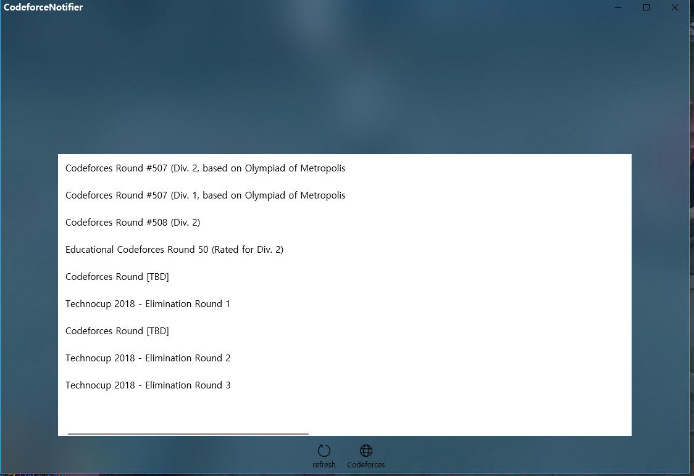
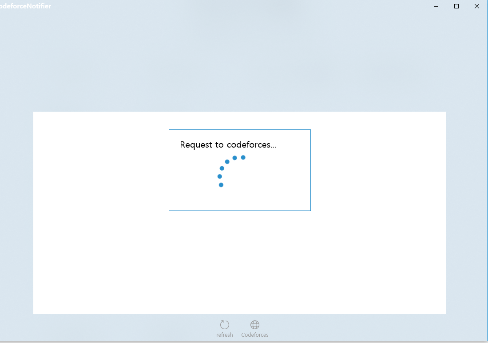
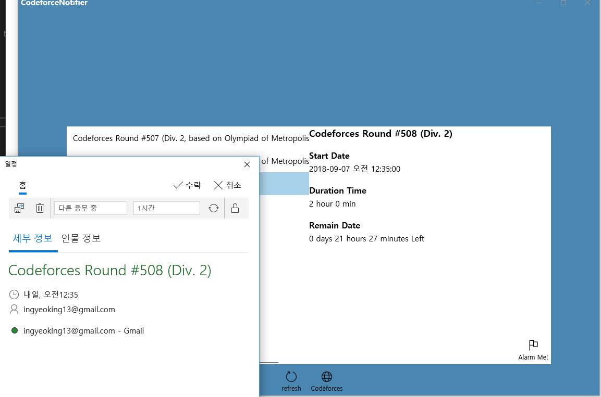

# Codeforces Notifier

## 1. Purpose

**the purpose** of this app is to help a user not to be late for or forget contest schedule.

## 2. Functionality

1. Use the Http Request   
2. Set Window Appointment
3. Open web browser

## 3. Image

## 4. Privacy Policy

#### **what my app do**  
my App use Http Request  
my App access Windows Appointment   
my App open Web Browser  

#### **what my App doesn't**
my App doesn't collect any information from you when you use my App.  
my App doesn't access any user's file.  

#### **User Consent**   
by using my App, you consent to App Privacy Policy  

## 5. Download Link

N/A, yet.

## 6. Contacts  

ingyeoking13@gmail.com  
gaelim@naver.com  
